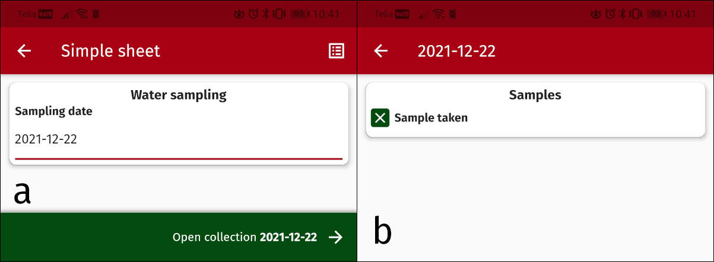

# Introduction

This version of TagTags is a complete rewrite and introduces substatial changes which makes it fundamentally incompatible with the original app. The goal has been to increase reliability and performance by revising the data structure and by leveraging powerful existing technologies for data storage and transfer. The mobile app is written in Dart and uses the Flutter framework.

# TagTags sheet structure

In this iteration of the app, all data is stored as key-value pairs in a table in an SQLite database. Sheets are written in JSON following a specific structure and all sheets are divided into two pages:

1. Identifier construction - This first view presents the user with a few input fields which together should form a unique identifier after executing a constructor function specified in the document.
2. Data collection - This view is where data is actually collected, these values can then be grouped together using the unique identifier passed from the first page.
	
The constructed identifier, static project id and parameter name together form a unique identifier in the database. Each field on the data collection page corresponds to one row in the database and each field independently tell the application to update their data when changed. Data is stored as text following type specific formatting in the database.

## Data and field types

TagTags 2 has 10 different data types, most of which are equivalent to data types in TagTags 1.

1.  Text
2.  Number
3.  Select
4.  Date
5.  Time
6.  Boolean
7.  Coordinates
8.  Camera
9.  ~~~Multiple choise~~~ (to be implemented)
10. Function field

The data-type of each field in a TagTags sheet affects both how the field is rendered in the app and how the data is formatted in the database.

## Sheet and field properties

A TagTags sheet has the following basic structure

```json
{
	"columns": 2,
	"identifier": {
		"title": "Title of identifier page",
		"fields": [
			//... list of fields
		],
		"constructor": "expression"
	},
	"groups": [
		// ... list of groups
	]
}
```

The columns value determines how many columns the groups should be split into, it is possible to override this setting in the app. The identifier property is a group of input fields used specifically to construct a unique sampling identifier. These fields are shown in a separate view to all other input fields, and the data entered here is not saved. The constructor parameter is required and contains the expression used to construct the sampling identifier, it must resolve to a non-NULL value.

A basic text-input field is defined below. The properties available for fields vary by which type they belong to.

```json
{
	"id": "unique_field_id (not shown)",
	"title": "Field title (shown)",
	"type": 1
}
```

Field ids can only contain lowercase alphanumerical characters and underscores, they are the names used for each field in the stored data in the database and are also used when referring to fields in expressions.

Groups are collections of fields and all data collection fields must be contained within a group. The groups are shown on the view following the sampling identifier construction view. An example of a group is shown below.

```json
{
	"title": "Measurements",
	"fields": [
		//... list of fields
	]
}
```

An example of a very basic complete sheet is shown below.

```json
{
	"columns": 1,
	"identifier": {
		"title": "Water sampling",
		"fields": [
			{
				"id": "sampling_date",
				"title": "Sampling date",
				"type": 4
			}
		],
		"constructor": "$sampling_date"
	},
	"groups": [
		{
			"title": "Samples",
			"fields": [
				{
					"id": "sample_taken",
					"title": "Sample taken",
					"type": 6
				}
			]
		}
	]
}
```

Loading the above sheet into the app results in a sheet with the two views shown in the image below.



### Field properties

The following table describes all field properties available in TagTags, if they are required or not, which type of data they expect, and with which field types they work. Default values in bold.

| Property              | Expected value    | Required | Field types   | Description                                                                                       |
|-----------------------|-------------------|----------|---------------|--------------------------------------------------------------                                     |
| id                    | string            | *Yes*    | *ALL*         | Identifier for the field. Must only contain lowercase alphanumeric characters or underscores.     |
| title                 | string            | *Yes*    | *ALL*         | Title for the field in the app, can contain any characters.                                       |
| type                  | int (1-10)        | *Yes*    | *ALL*         | Specifies which input type the field will have, and which properties it will accept.              |
| description           | string            | No       | *ALL*         | A description of expected data, shown to the user below the title in the app.                     |
| mandatory             | true/**false**    | No       | *ALL*         | When true, the user will be warned before leaving data collection if there is no value.           |
| remember_values       | true/**false**    | No       | *ALL*         | When set to true, The field will autofill the most recent value.                                  |
| visible_if            | string            | No       | *ALL*         | A valid expression resolving to either TRUE or FALSE, determines if the field is visible or not.  |
| default_checked       | true/**false**    | No       | 6             | Set to true if the checkbox should appear as checked by default.                                  |
| alternatives          | []string          | *Yes*    | 3, 9          | A list of strings making up values that can be selected.                                          |
| allow_other           | true/**false**    | No       | 3             | When set to true, allow the user to enter values not present in the list of alternatives.         |
| barcode               | true/**false**    | No       | 1             | When set to true, adds a bar-/QR code-reader to autofill the input field.                         |

## Expressions

TagTags 2 supports relatively complex expressions that are used in three contexts within the app:

1. Construction of unique identifiers within each sheet.
2. Calculating/transforming values within the calculated data type.
3. Determining if specific fields should be visible or not based on values in other fields.

Expressions can include variables, i.e. they can pull values from other fields within the same sheet.

### Strings

Strings should be enclosed using backtiks: &grave;, e.g: *&grave;foobar&grave;*; alternatively you may use double-quotes: ", eg: *"foobar"*. TagTags automatically encloses values pulled from other fields that are not numbers or booleans in backtiks.

### Basic mathematical operations

The expression engine supports all basic mathematical operations and boolean comparisons, i.e (with operators in parentheses): addition (+), subtraction (-), multiplication (*), division (/), modulus (%), equals (=), does not equal (!=), greater than (>), greater than or equal to (>=), less than (<), less than or equal to (<=). Comparisons return either TRUE or FALSE, text can also be compared, but for obvious reasons it is only possible to determine if the values are equal or not.

### Functions

The following functions are implemented in the TagTags expression engine:

* abs(x) - Returns the absolute value of x.
* pow(x,y) - Returns x to the power of y, or NULL if x or y is NULL.
* sqrt(x) - Returns the square root of x, or NULL if x is NULL.
* sin(x) - Returns the sine of x, or NULL if x is NULL.
* cos(x) - Returns the cosine of x, or NULL if x is NULL.
* tan(x) - Returns the tangent of x, or NULL if x is NULL.
* asin(x) - Returns the arc sine of x in radians, or NULL if x is NULL.
* acos(x) - Returns the arc cosine of x in radians, or NULL if x is NULL.
* atan(x) - Returns the arc tangent of x in radians, or NULL if x is NULL.
* coalesce(x<sub>1</sub>,x<sub>2</sub>,x<sub>3</sub>,...,x<sub>n</sub>) - Returns the first value that is not NULL.
* round(x,y) - Returns x rounded to y decimal places, or NULL if x or y is NULL.
* length(x) - Returns the number of characters in x or NULL if x is NULL.
* concat(x<sub>1</sub>,x<sub>2</sub>,x<sub>3</sub>,...,x<sub>n</sub>) - Concatenates all arguments to a single string, returns NULL if any value is NULL.
* right(x, y) - Returns the y right most characters in x, or NULL if x is NULL.
* left(x, y) - Returns the y left most characters in x, or NULL if x is NULL.
* contains(x, y) - Returns TRUE if x contains y, otherwise FALSE. Returns NULL if x or y is NULL.
* startswith(x, y) - Returns TRUE if x starts with y, otherwise FALSE. Returns NULL if x or y is NULL.
* endswith(x, y) - Returns TRUE if x ends with y, otherwise FALSE. Returns NULL if x or y is NULL.
* lcase(x) - Returns x in all lowercase letters, or NULL if x is NULL.
* ucase(x) - Returns x in all capical letters, or NULL if x is NULL.
* index(x, y) - Returns the index of y in x, or NULL if x or y is NULL. Returns -1 if y is not present in x.
* and(x<sub>1</sub>,x<sub>2</sub>,x<sub>3</sub>,...,x<sub>n</sub>) - Returns TRUE if all arguments are TRUE.
* or(x<sub>1</sub>,x<sub>2</sub>,x<sub>3</sub>,...,x<sub>n</sub>) - Returns TRUE if at least one argument is TRUE.
* if(c,x,y) - Returns x if c is TRUE, otherwise returns y.
* switch(c,w<sub>1</sub>:t<sub>1</sub>,w<sub>2</sub>:t<sub>2</sub>,...,w<sub>n</sub>:t<sub>n</sub>,e) - Compares c to w<sub>x</sub> and returns t<sub>x</sub> when they match, or e (must be the final argument) if there is no match. Returns NULL if there is no match and no e.

It is possible to nest functions freely, so long as the nested functions return the correct data type. Internally everything is treated as text, so type depends on the context.

### Variables

Variables are referenced as the field id with a leading dollar sign, i.e. the field with id *foobar* should be referenced in expressions as *$foobar*. If a value is set for the variable it will be substituted in the expression, but if there is no value *NULL* will be used in its place (i.e. *no data*).

If the value in the variable is neither a number nor a boolean, it will be automatically enclosed in backtiks. Additionally, TagTags will escape all operators within values pulled from other fields in the same sheet using HTML escape sequences to avoid unexpected behaviour (excluding leading minus signs at the start of numeric values), these are then unescaped when the results are presented. Character replacement is done according to the table below.

| Character | Replaced with | Caviat                                                  |
|---        |---            |---                                                      |
| `+`       |`&plus;`       |                                                         |
| `-`       |`&hyphen;`     | Not if it is the leading character followed by a number |
| `/`       |`&sol;`        |                                                         |
| `*`       |`&ast;`        |                                                         |
| `<`       |`&#060;`       |                                                         |
| `>`       |`&#062;`       |                                                         |
| `(`       |`&lpar;`       |                                                         |
| `)`       |`&rpar;`       |                                                         |
| `%`       |`&percnt;`     |                                                         |
| `=`       |`&equals;`     |                                                         |
| `$`       |`&#36;`        |                                                         |

This means that, for example, the date string *2022-07-05* is processed internally as *2022&hyphen;07&hyphen;05* and that e.g. *length()* will return 24 rather than 10, which is necessary to keep in mind.

### Examples

Given a field with the ID *temp*, the expression below will convert from Fahrenheit to Celcius.
```
($temp-32)*5/9
```

Given the fields *year*, *sampling*, and *site*, the below argument will construct a sampling ID for the regular stream sampling programme in Krycklan.
```
concat(`1-101`,right($year,2),right(concat(0,$sampling),2),
right(concat(0,$site),2))
```

# The server

The server is central to TagTags 2, it handles distribution of sheets, data synchrionization, users and access levels. Additionally, the default server includes a web-UI for instant access to synchronized data. The default sever is written in Go and is to be seen as a reference implementation, I fully encourage others to write their own implementations to integrate with other data collection systems. I intend to do the same. Therefore, the API should remain fairly stable.

## Setting up the default TagTags-server

The server application included with TagTags is perfectly capable and the code should compile for all major platforms (i.e. Linux, Windows, and Mac). The server must be run behind a  reverse proxy with SSL as the default connectivity framework in flutter flat out refuses to connect over unencrypted HTTP.  Either way, without SSL all communication between the app and the server will be in plain text.

Below is an example server configuration with TagTags server behind an NGINX reverse proxy, with TagTags server listening on the default port (42506).

```
server {
    listen 443 ssl http2;
    server_name tagtags.example.org;
    client_max_body_size 60M;

    location / {
        proxy_pass http://localhost:42506;
    }

    ssl_certificate /path/to/ssl/certificate/fullchain.pem;
    ssl_certificate_key /path/to/ssl/certificate/privkey.pem;
}
```

Using this configuration the server would be accessible at **https**://tagtags.example.org. Unless the firewall is set up to deny incomming connections on port 42506 it is possible to circumvent NGINX, so it is ofcourse preferable if the firewall is set up to deny incoming external connections on the default port.

## Authenticating with the server

The app authenticates with the server by writing the username and password in the request header, therefore any server implementation should check and accept authentication using the following two headers:

* X-TagTags-Username
* X-TagTags-Password

## API endpoints

Any tagtags server implementation needs to implement the following RESTful API endpoints for communication with the app. URL elements enclosed in curly brackets denote variable data, i.e. they math a regex or any string, the information is then used by the server to determine what the user is requesting.

### Request list of sheets

**URL**: /app/sheets
**METHOD**: GET

The server should respond with a JSON-formatted list of all sheets accessible by the user, formatting as below. The version variable is used by the app to determine if a newer version of the sheet is available to what is currently on the device, so it should be incremented by the server whenever the sheet is updated. The sheet ID should be a string.

```json
[
	{
		"id": "1",
		"project": "demo-project",
		"version": 1,
		"name": "Demonstration sheet"
	},{
		"id": "54565f1e-9fe9-49fe-ae70-87f7272203d1",
		"project": "another-demo-project",
		"version": 5,
		"name": "Another demonstration sheet"
	}
]
```

### Request download of sheet

**URL**: /app/sheets/{id}
**Method**: GET

If the user has permission to access the sheet identified by *id*, the server should reply with the full sheet in JSON format and the headers in the table below. If not, the server should respond with error code 401 (Unauthorized).

| Header                            | Value                                            |
| --                                | --                                               |
| X-TagTags-Sheet-Name-Base64       | The name of the sheet in UTF-8 encoded as Base64 |
| X-TagTags-Sheet-Project           | The ID of the project the sheet belongs to       |
| X-TagTags-Sheet-Version           | The sheet version, as an integer                 |

### Request sheet details

**URL**: /app/sheets/{id}/details
**Method**: GET

Same as requesting a sheet download, however the server should only reply with the detail headers set. The app uses this endpoint to determine of a sheet has an update available.

### Request project data

**URL**: /app/projects/{project}/data
**METHOD**: GET

If the user has access to *project*, the server should reply with a JSON-formatted list of all available data for that project. The app may also include the header *X-TagTags-MostRecentSync* which in that case contains the unix timestamp of the most recent synchronization event, and the server may then only respond with data that has been updated since then. The reply show be formatted as below.

```json
[
	{
		"project": "demo-project",
		"identifier": "2021-12-23_demodata_1",
		"parameter": "field_notes",
		"type_id": 1,
		"value": "Nothing to report.",
		"modified": 1640248886
	},{
		"project": "demo-project",
		"identifier": "2021-12-23_demodata_1",
		"parameter": "air_temp",
		"type_id": 2,
		"value": "-21",
		"modified": 1640248888
	}
]
```

*type_id* in the response corresponds to the data type in the sheet, and *modified* should be the unix-timestamp of when the value was originally entered in the app.

### Upload project data

**URL**: /app/projects/{project}/data
**METHOD**: POST

If the user has access to *project*, the server should store the incoming JSON-array of new data. Incoming data is formatted exactly as how the server reports project data (see the previous section).

### File download

**URL**: /app/projects/{project}/data/files/{filename}
**METHOD**: GET

The app is requesting the file associated with a datapoint. If the user has access, the server should reply with the filename in the *Content-disposition* header, and the file as binary data.

### File upload

**URL**: /app/projects/{project}/data/files
**METHOD**: POST

The app is sending a datapoint with an associated file (i.e. an image). The request is formatted as a multipart request, including one field named *data* containing the datapoint and one file. The file name and *value* parameter of the datapoint should be the same. The datapoint would be formatted as below.

```json
{
	"project": "demo-project",
	"identifier": "2021-12-23_demodata_1",
	"parameter": "field_photo",
	"type_id": 8,
	"value": "TT_field_photo_1619092191357.jpg",
	"modified": 1640248895
}
```

### Single datapoint upload

**URL**: /app/projects/{project}/{identifier}/{parameter}
**METHOD**: POST

The app is sending a single datapoint beloning to *project*, with the identifier: *identifier*, and parameter name: *parameter*. If the user has access to project, the datapoint should be saved. See an example datapoint below.

```json
{
	"project": "demo-project",
	"identifier": "2021-12-23_demodata_1",
	"parameter": "field_notes",
	"type_id": 1,
	"value": "Nothing to report.",
	"modified": 1640248886
}
```
